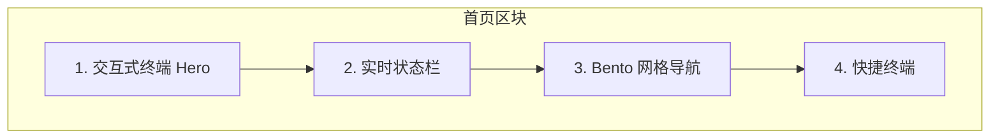

# 首页交互重设计方案

> 本文件为设计计划归档，与实现对应；路径：`docs/homepage-interactive-redesign-plan.md`。

**概述**：将首页从静态 Hero + 四卡片导航重新设计为一个有趣、吸睛、让人想互动的体验 — 包含交互式终端、状态仪表盘、Bento 网格布局和微交互，完全基于现有 Terminal Architect 设计系统。

---

## 灵感来源

基于对获奖个人作品集网站的调研：

- **Maxim Kich** (Awwwards 荣誉提名) -- CLI 风格交互式游乐场，ASCII 艺术、隐藏小游戏、终端式导航、微交互。与你现有的 Terminal Architect 系统高度契合。
- **R--K '26** (Codrops 专题) -- 以「存在感」驱动的 Hero 区、滚动联动的渐显动画、声音开关、精心设计的页脚细节、clip-path 页面转场。
- **BilloDesign** -- 3D Spline 球体跟随光标移动，对交互产生反应。
- **Milo AI** (Awwwards 提名) -- 手势交互、复古风格、隐藏彩蛋。
- **Cyberpunk Bento Grid** (SmarterKits) -- 非对称 Bento 网格配合霓虹强调色、毛玻璃卡片、复古未来风指标展示。

---

## 首页整体架构



---

## 区块 1：交互式终端 Hero（重设计当前 Hero 区）

**当前状态**：静态标题 + 固定内容的终端模拟框。

**改造方案**：

- **动态标题**：保留「解构未来」但加入**打字轮播效果** -- 「未来」这个词循环切换为 `未来` / `产品` / `体验` / `可能性`，配合打字-删除-重打动画。制造视觉动感和好奇心。
- **终端模拟器升级**：外观保持现有风格不变，但内部文字改为**逐行打字动画** -- 每一行随着闪烁光标依次出现，模拟系统启动过程。`$` 提示行逐字打出，技术标签依次淡入。
- **CTA 按钮**：保留但给主按钮加上微弱的**霓虹脉冲**动画，吸引点击。

关键文件：[`app/page.tsx`](../app/page.tsx)（Hero 区），新建客户端组件 `components/typing-cycle.tsx`。

---

## 区块 2：实时状态栏

Hero 与 Bento 网格之间的窄横条，强化「指挥中心」的感觉。

内容（全部等宽字体、小号文字、`[标签]` 格式）：

- **SYSTEM**：`STATUS: ONLINE` -- 绿色圆点闪烁
- **TIME**：`UTC+8 HH:MM:SS` -- 客户端实时时钟，每秒更新
- **FOCUS**：`当前关注: 前端体验 & 产品思维` -- 静态或缓慢轮播
- **UPTIME**：`SITE_UPTIME: XXXd` -- 从部署日期起计算的运行天数

实现方式：一个客户端组件 `components/status-bar.tsx`，用 `useEffect` + `setInterval` 驱动时钟。完美契合 Terminal Architect 的「HUD 数据读出」设计模式。

---

## 区块 3：Bento 网格导航（替代当前四卡片等分网格）

**最大的视觉改变**。用**非对称 Bento 网格**替代均匀的 `grid-cols-4`，卡片大小和内容类型各不相同，创造视觉节奏感，激发探索欲。

### 网格布局（桌面端，4 列）

```
+------------------+----------+----------+
|                  |  技能栈  |  GitHub  |
|   个人介绍       |  标签墙  |  链接卡  |
|   大卡片         +----------+----------+
|   (跨2列2行)     |  最新分享              |
|                  |  (跨2列1行)           |
+--------+---------+----------+----------+
| 关于   |  项目   |  联系 CTA             |
| 入口   |  入口   |  (跨2列1行, 强调色)   |
+--------+---------+------------------------+
```

### 卡片详情

1. **个人介绍（大卡，跨 2 列 x 2 行）**：毛玻璃卡片，展示你的名字/头衔、一句简介，背景是动态 ASCII 艺术或生成式图案。悬停时背景微妙偏移。这是 Bento 的「主角卡」。

2. **技能 / 技术栈（1x1）**：悬停发光的动画标签，或用 CSS 动画做一个小型技能可视化。技术标签来自 `lib/site.ts` 的 `stackTags`，展示为可交互的药丸按钮。

3. **GitHub 链接（1x1）**：深色卡片，GitHub 图标 + 你的用户名 `@oiidawn` + 微妙的动画边框（旋转虚线边框）。点击跳转 GitHub。

4. **最新分享（跨 2 列）**：展示 `lib/site.ts` 中 `shares` 的最新一条。标题 + 描述 + 阅读时长。悬停显示「阅读 >」箭头动画。

5. **关于入口（1x1）**：`[ENTRY_01]` 风格卡片，链接到 `/about`。等宽标签 + 「简介 / 轨迹 / 技能栈」。

6. **项目入口（1x1）**：`[ENTRY_02]` 风格卡片，链接到 `/projects`。

7. **联系 CTA（跨 2 列）**：主要行动号召卡片，霓虹光晕效果。「开始对话」+ 邮箱链接。强调色背景延续当前设计。

### 卡片交互增强

- **3D 悬停倾斜**：每张卡片根据鼠标在卡片内的位置施加微妙的 `perspective` + `rotateX/Y` 变换。用 `onMouseMove` 实现为可复用的 `components/tilt-card.tsx` 客户端组件。
- **交错渐显**：卡片使用现有 `.reveal` 动画类加交错延迟，页面加载时产生瀑布式入场效果。
- **霓虹边框光晕**：悬停时卡片获得青色或紫色的 `box-shadow` 发光。

---

## 区块 4：快捷终端（底部交互彩蛋）

页面底部的一个小型「命令提示符」 -- 一个终端风格的单行输入框。用户可以输入简单命令：

- `help` -- 显示可用命令列表
- `about` -- 导航到 /about
- `projects` -- 导航到 /projects
- `hello` -- 回复一句有趣的问候
- `ls` -- 列出页面各区块
- `sudo rm -rf /` -- 返回幽默的「想得美」回复

这是让访客「忍不住想玩」的趣味钩子。实现为 `components/quick-terminal.tsx` 客户端组件，用 state 管理输入/输出，`useRouter` 处理导航命令。

---

## 微交互与细节打磨

- **自定义光标光晕**：一个跟随鼠标移动的淡青色径向渐变。用 `pointer-events: none` 的覆盖层实现，纯 CSS 或轻量 JS。组件：`components/cursor-glow.tsx`。
- **扫描线覆盖层**：`globals.css` 中已实现 `.scanline-overlay` 但首页未使用。添加到 PageShell 以获得微妙的 CRT 氛围感。
- **滚动触发渐显**：已有 `.reveal` 类。扩展为基于 `IntersectionObserver` 的方案，让元素在滚入视口时才触发动画，而非仅在页面加载时。

---

## 技术方案

- 所有新的交互元素都是**客户端组件**（`"use client"`），保持页面壳和静态内容服务端渲染。
- **无需新增依赖** -- 打字效果、倾斜变换和迷你终端都可以用 React state + CSS 动画 + `requestAnimationFrame` 实现。
- 尊重 `prefers-reduced-motion`（`globals.css` 已对 `.reveal` 做了处理；扩展到新动画）。
- 数据继续来自 [`lib/site.ts`](../lib/site.ts)，不需要 API 调用。
- **移动端**：Bento 网格折叠为单列。触屏设备禁用倾斜效果。快捷终端隐藏或简化。

---

## 文件变更清单

- [`app/page.tsx`](../app/page.tsx) -- 重写：新 Hero + 状态栏 + Bento 网格 + 快捷终端
- [`app/globals.css`](../app/globals.css) -- 新增：倾斜卡片样式、打字动画关键帧、状态栏样式
- `components/typing-cycle.tsx` -- **新建**：打字轮播客户端组件
- `components/status-bar.tsx` -- **新建**：实时状态栏客户端组件
- `components/tilt-card.tsx` -- **新建**：3D 悬停倾斜客户端组件
- `components/quick-terminal.tsx` -- **新建**：交互命令行客户端组件
- `components/cursor-glow.tsx` -- **新建**：鼠标跟随光晕客户端组件
- [`lib/site.ts`](../lib/site.ts) -- 小改：添加部署日期常量用于运行天数计算

---

## 视觉概念图

```
+================================================================+
|  [OII_DAWN]   主页  关于  项目  分享        邮箱 GitHub X      |  <- 顶栏（不变）
+================================================================+

  ▸ Init sequence
  解构 [未来|产品|体验]          <- 打字轮播效果

  我热爱把想法做成可用的产品...    <- 简介文字

  +-- user@portfolio:~ bio --------------------------------+
  | $ 加载个人档案…               <- 逐行打字动画           |
  | $ 分析完成。系统就绪。                                    |
  |                                                        |
  | 专注于前端与产品体验...                                   |
  | [STACK] NEXT_JS TYPESCRIPT PRODUCT_UX CONTENT          |
  | > _                            <- 闪烁光标              |
  +--------------------------------------------------------+

  [了解我]  [看看分享]             <- CTA 按钮 + 霓虹脉冲

━━━━━━━━━━━━━━━━━━━━━━━━━━━━━━━━━━━━━━━━━━━━━━━━━━━━━━━━━━
STATUS: ONLINE  |  UTC+8 15:42:07  |  FOCUS: 前端体验  |  UPTIME: 127d
━━━━━━━━━━━━━━━━━━━━━━━━━━━━━━━━━━━━━━━━━━━━━━━━━━━━━━━━━━

  [NAV_HUB]
  选择模块

  +------------------------------+----------+----------+
  |                              |  技能栈  |  GitHub  |
  |   Zhang JM                   | ┌──────┐ | @oiidawn |
  |   前端 · 产品 · 内容          | │skills│ |   ──>    |
  |   ~~~~~~~~~~~~               | └──────┘ |          |
  +------------------------------+----------+----------+
  |                              | 最新分享：            |
  |                              | 我如何管理长期学习... |
  +-------------+----------------+---------------------+
  |   关于      |    项目        |  开始对话              |
  | [ENTRY_01]  |  [ENTRY_02]   |  oii.zhangjm@gmail   |
  +-------------+----------------+---------------------+

  > 输入命令... help / about / projects       <- 快捷终端

+================================================================+
|  页脚                                                          |
+================================================================+
```
